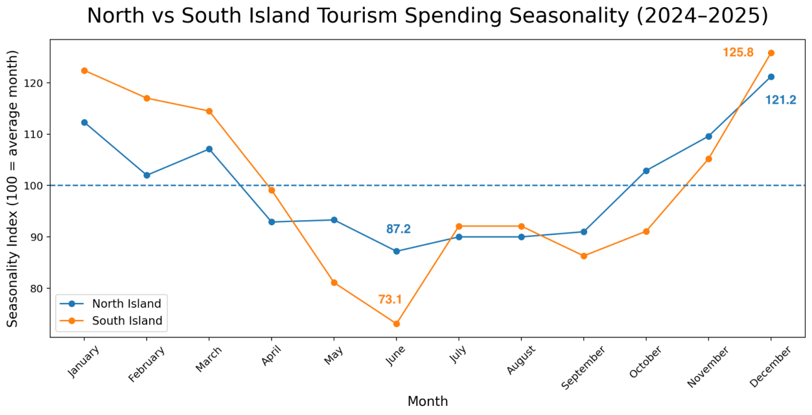
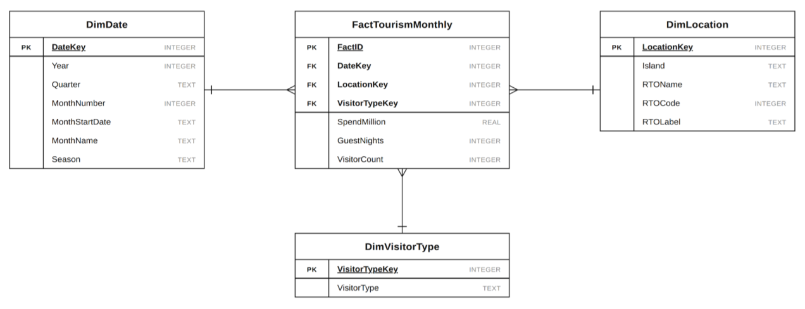
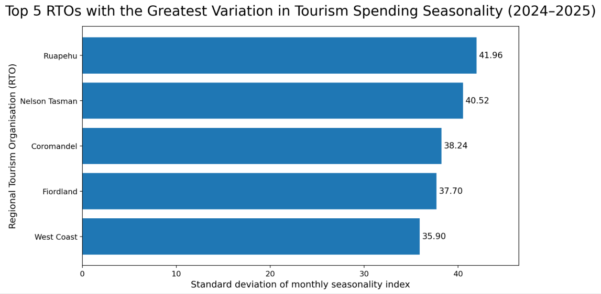
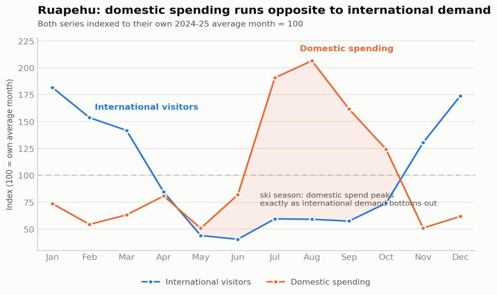
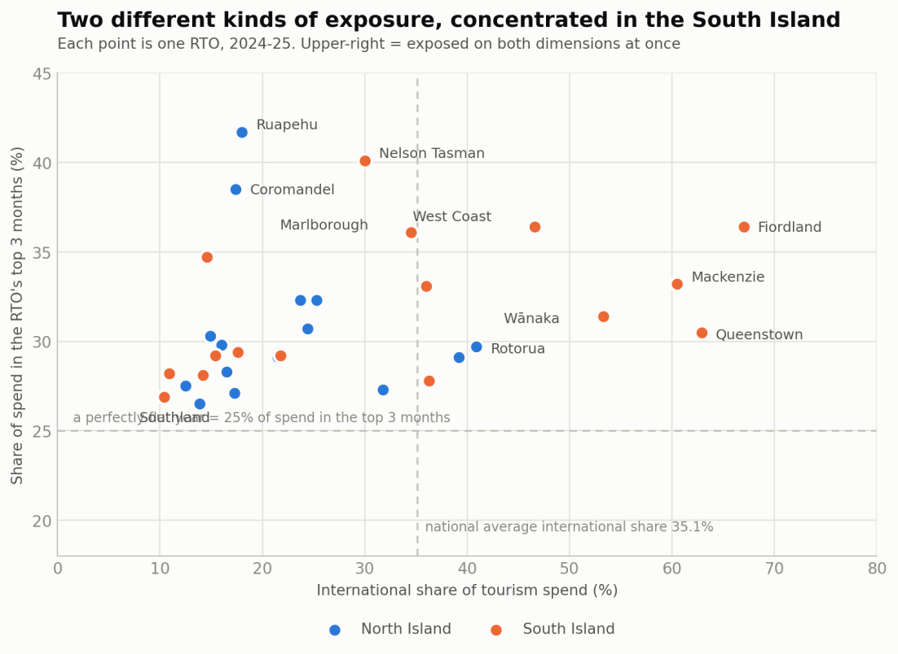
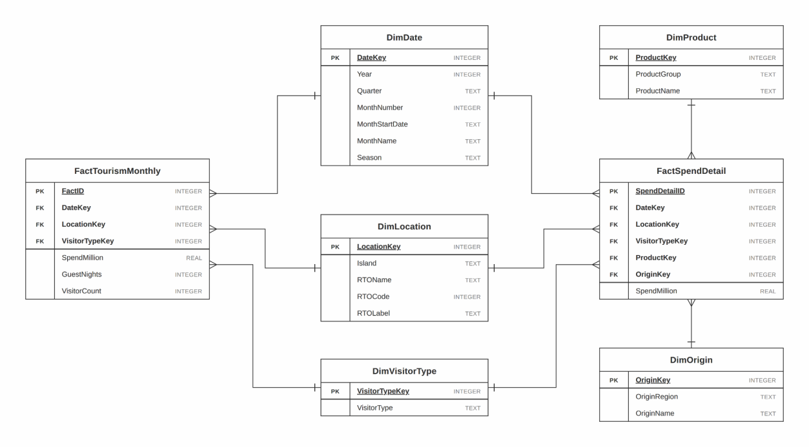

# Tourism Resilience Across New Zealand

A SQLite data warehouse and SQL analysis asking whether domestic demand stabilises off-season tourism spending, and which regions are most exposed to tourism shocks.

**Stack:** SQL · SQLite · star schema · ELT · CTEs and window functions · Streamlit

## The question

New Zealand's national tourism figures hide large regional differences. Two destinations can report the same annual total while one earns most of it from overseas visitors in three summer months and the other earns it steadily all year. This project asks which Regional Tourism Organisation (RTO) areas sustain tourism income year-round, in three parts:

1. How does tourism seasonality vary across RTOs, and between the North and South Islands?
2. When international visitor demand is low, how do domestic visitors, spending and guest nights change?
3. Which RTOs depend most on peak-season or international demand, and are therefore most vulnerable?

## Key findings

All results cover the two complete calendar years 2024 and 2025.

- **The South Island is more seasonal.** Its spending runs from about 26% above its average month in December to 27% below in June, a 53-point spread. The North Island's spread is about 34 points.
- **Domestic demand is a limited buffer.** Domestic visitor numbers fall in all 38 RTOs when international demand is weak, by a median of 19.9%. Domestic spending holds up better: across the 31 RTOs with spending data the median change is −5.6%, and spending rises in 11 of them.
- **A buffer needs an off-season driver.** In Ruapehu, domestic visitors fall 17.6% in weak international months while domestic spending rises 110.7%, from $5.65 million to $11.92 million a month. Its peak spending months are July to September.
- **Exposure is concentrated in the South Island.** Eight of the ten highest-scoring RTOs on the project's vulnerability measure are in the South Island.

<p align="center">
  
</p>

## Data warehouse design

Three public tourism datasets were integrated into one star schema. The fact table, `FactTourismMonthly`, has a grain of one row per month, RTO and visitor type, and holds 2,259 rows across 38 RTO areas and 30 months (January 2024 to June 2026).

<p align="center">
  
</p>

| Source dataset | Publisher | Raw rows | Contributes | Aggregated across |
|---|---|---|---|---|
| Monthly Regional Tourism Estimates (MRTE) | MBIE | 240,180 | `SpendMillion` | 7 products × 29 origin markets |
| Accommodation Data Programme (ADP) | MBIE | 420,736 | `GuestNights` | 6 accommodation property types |
| Tourism Volumes and Flows (TV&F) | MBIE | 5,499 | `VisitorCount` | already at the fact grain |
| Regional Tourism Organisation Areas 2025 | Stats NZ | 41 | `DimLocation` attributes | reference data |

The dimensions support two hierarchies in `DimDate` (Year → Quarter → Month and Year → Season → Month) and one in `DimLocation` (Island → RTO). Every dimension has an integer primary key, all three foreign keys are declared, and a `UNIQUE` constraint on the three keys enforces the grain in the database itself.

## ELT pipeline

Raw files are loaded into SQLite as text, and every cleaning and modelling step then runs in SQL.

1. **Extract.** Four datasets downloaded from MBIE's Tourism Evidence and Insights Centre and the Stats NZ Geographic Data Service.
2. **Load.** Each CSV imported as a raw table with every column as `TEXT`, so nothing is coerced on import.
3. **Clean** ([`sql/Project_702_Data_Cleaning.sql`](sql/Project_702_Data_Cleaning.sql)). Typed, constrained tables are built with `INSERT ... SELECT` and restricted to RTO-level records from January 2024 to June 2026. Two date formats are normalised to the first day of the month, three sets of visitor-type labels are standardised to `Domestic` and `International`, and each source is joined to the RTO mapping on a different key. ADP values suppressed for confidentiality are excluded, not read as zero.
4. **Model** ([`sql/Project_702_DataWarehouse_and_Analysis.sql`](sql/Project_702_DataWarehouse_and_Analysis.sql)). `DimDate` is generated as a continuous monthly calendar with a recursive CTE, the three sources are aggregated to the fact grain, and the fact table is loaded with left joins so that a missing measure stays `NULL`.
5. **Validate.** The same script checks completeness and integrity.

| Check | Result |
|---|---|
| Fact table rows | 2,259 |
| RTOs represented | 38 of 41 areas |
| Rows missing `SpendMillion` | 399 (31 RTOs report spending) |
| Rows missing `GuestNights` | 759 (25 RTOs report guest nights) |
| Rows missing `VisitorCount` | 93 (38 RTOs report visitor counts) |
| Duplicate rows at the grain | 0 |
| Orphan foreign keys | 0 |

Because coverage differs by source, every analytical query filters on the relevant measure being `NOT NULL`.

## Analysis

The three queries are at the end of [`sql/Project_702_DataWarehouse_and_Analysis.sql`](sql/Project_702_DataWarehouse_and_Analysis.sql). Each is a multi-stage query built from CTEs.

### Query 1: seasonality

Each area's monthly spending is divided by its own average month to give a seasonality index (100 = average month), so areas of very different sizes can be compared. The standard deviation of the 12 monthly indices summarises how seasonal an area is.

| Area | December index | June index | Standard deviation |
|---|---|---|---|
| South Island | 125.8 | 73.1 | 16.24 |
| North Island | 121.2 | 87.2 | 10.37 |

Individual RTOs vary far more than the islands do. Ruapehu is the most seasonal (standard deviation 41.96), followed by Nelson Tasman (40.52), Coromandel (38.24), Fiordland (37.70) and West Coast (35.90).

<p align="center">
  
</p>

### Query 2: does domestic demand fill the gap?

Each RTO-month is classed as a low international-demand month when international visitor counts fall below that RTO's own 2024 to 2025 average. Domestic visitors, spending and guest nights are then compared between low-demand months and the rest.

Domestic visitor numbers are lower in low-demand months in every RTO, by between 12.1% and 46.4%. Spending tells a different story in some regions: Queenstown loses 23.6% of its domestic visitors but gains 10.9% in domestic spending, and Waikato, Wellington and Rotorua each gain 12% to 13%.

<p align="center">
  
</p>

These are associations, not causes. The warehouse holds no trip-purpose data, so the ski-season explanation for Ruapehu is inferred from the seasonal pattern.

### Query 3: which regions are most exposed?

Two indicators are calculated for each RTO: the share of spending that comes from international visitors, and the share that falls in its three highest-spending months (found with `ROW_NUMBER()` partitioned by RTO). Their average is a composite vulnerability score.

| RTO | Island | International share | Top 3 months | Score |
|---|---|---|---|---|
| Fiordland | South | 67.0% | 36.4% | 51.7 |
| Mackenzie | South | 60.5% | 33.2% | 46.8 |
| Queenstown | South | 62.9% | 30.5% | 46.7 |
| Wānaka | South | 53.3% | 31.4% | 42.4 |
| West Coast | South | 46.6% | 36.4% | 41.5 |
| Rotorua | North | 40.9% | 29.7% | 35.3 |
| Marlborough | South | 34.5% | 36.1% | 35.3 |
| Nelson Tasman | South | 30.0% | 40.1% | 35.1 |
| Kaikōura | South | 36.0% | 33.1% | 34.6 |
| Auckland | North | 39.2% | 29.1% | 34.1 |

The two risks are distinct. Fiordland, Mackenzie and Queenstown are heavily international but not unusually concentrated, while Ruapehu is the most peak-concentrated RTO (41.7% of spending in three months) yet only 18.0% international.

<p align="center">
  
</p>

The vulnerability score is a project-defined screening measure with equal weights, not an official MBIE indicator.

## Repository layout

```
.
├── sql/
│   ├── Project_702_Data_Cleaning.sql                # raw tables → clean, typed, constrained tables
│   └── Project_702_DataWarehouse_and_Analysis.sql   # star schema, indexes, validation, three analysis queries
├── data/
│   ├── raw/
│   │   ├── MRTE.csv           # spending by RTO, product, visitor type and origin
│   │   ├── ADP.csv            # accommodation measures by RTO and property type
│   │   ├── TVF.csv            # monthly visitor counts by RTO and population segment
│   │   └── RTO_Mapping.csv    # Stats NZ RTO Areas 2025 codes and names
│   └── database/
│       ├── Project_702_Clean.db.sql   # SQL dump after the cleaning stage
│       └── Project_702_Final.db.sql   # SQL dump of the finished warehouse
├── report/
│   └── tourism_resilience_report.pdf  # full 40-page project report
└── images/                            # figures from the report
```

## Running it

**Query the finished warehouse.** Load the final dump into a new SQLite database, then run any of the analysis queries against it:

```bash
git clone https://github.com/hannieng03/nz-tourism-resilience-sql.git
cd nz-tourism-resilience-sql
sqlite3 tourism.db < data/database/Project_702_Final.db.sql
```

**Rebuild it from the raw files.** In [DB Browser for SQLite](https://sqlitebrowser.org/), import the four CSVs with the first row as column names, using these table names, which the cleaning script expects:

| CSV | Table name |
|---|---|
| `data/raw/MRTE.csv` | `Raw_Spend` |
| `data/raw/ADP.csv` | `Raw-ADP(nights)` |
| `data/raw/TVF.csv` | `Visitor_Count_Raw` |
| `data/raw/RTO_Mapping.csv` | `Raw-RTO Areas Mapping` |

Then run `sql/Project_702_Data_Cleaning.sql` followed by `sql/Project_702_DataWarehouse_and_Analysis.sql`. The cleaning script drops the raw tables once the clean tables are built.

## Dashboard

An interactive [Streamlit dashboard](https://6jnbp2phjjbmiw22sfazyg.streamlit.app/) presents the main results from the final database.

## Limitations and future work

- The series covers 2024 to mid-2026 only, so structural patterns cannot be separated from post-pandemic recovery.
- Seven RTOs are absent from the spending data and thirteen from the guest-night data, so each finding applies only to the RTOs that report that measure.
- The report proposes a second fact table, `FactSpendDetail`, at month, RTO, product and origin grain, sharing the existing dimensions, to analyse spending by origin market.

<p align="center">
  
</p>

## Data sources

- Ministry of Business, Innovation and Employment. [Monthly Regional Tourism Estimates](https://teic.mbie.govt.nz/teiccategories/datareleases/mrte/). Tourism Evidence and Insights Centre.
- Ministry of Business, Innovation and Employment. [Accommodation Data Programme](https://teic.mbie.govt.nz/teiccategories/datareleases/adp/). Tourism Evidence and Insights Centre.
- Ministry of Business, Innovation and Employment. [Tourism Volumes and Flows](https://teic.mbie.govt.nz/teiccategories/datareleases/tv&f/). Tourism Evidence and Insights Centre.
- Stats NZ. [Regional Tourism Organisation Areas 2025](https://datafinder.stats.govt.nz/layer/122226-regional-tourism-organisation-areas-2025/). Stats NZ Geographic Data Service.

See the source pages for licence and reuse terms.

## Team

Group 20, BUSINFO 702, 2026 Quarter 3: Danni Wu, Zihan Song, Hannie Nguyen and Ha Nghiem.
